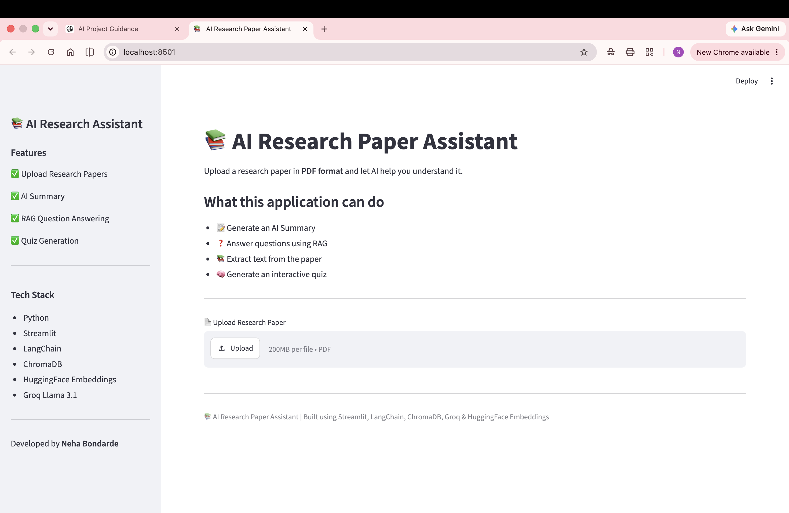
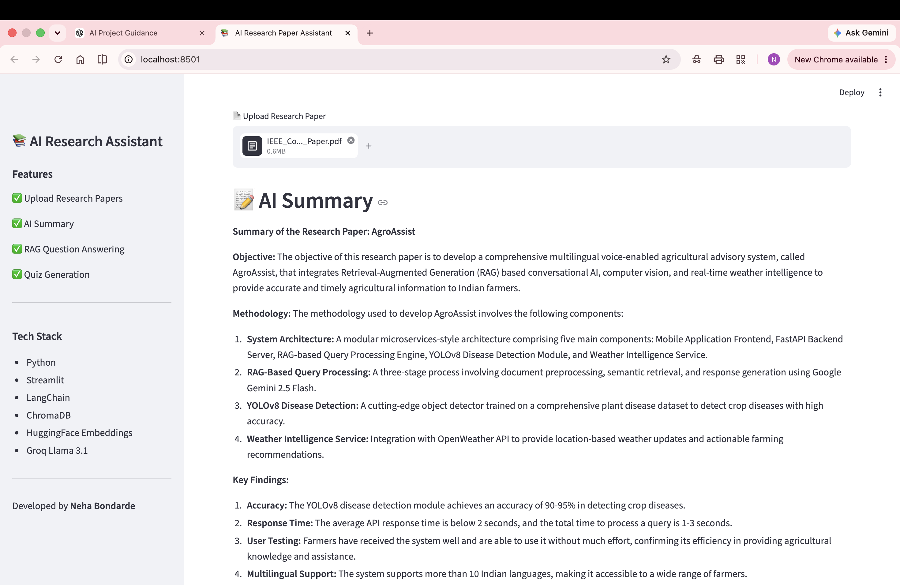
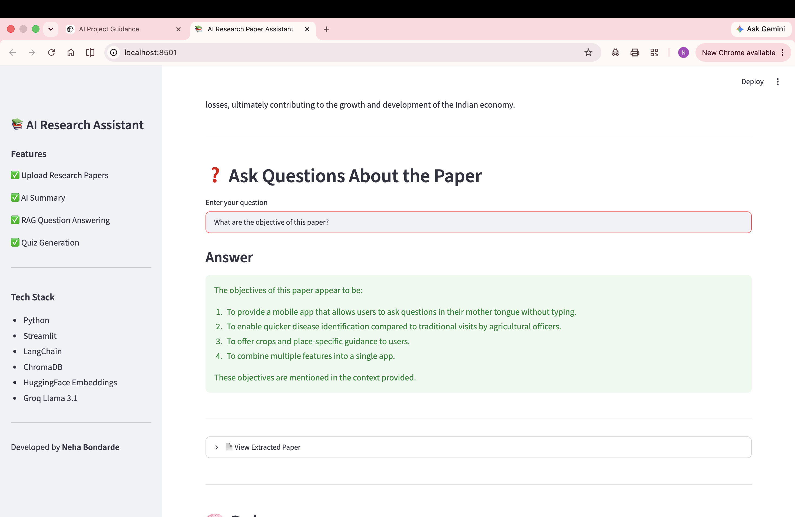
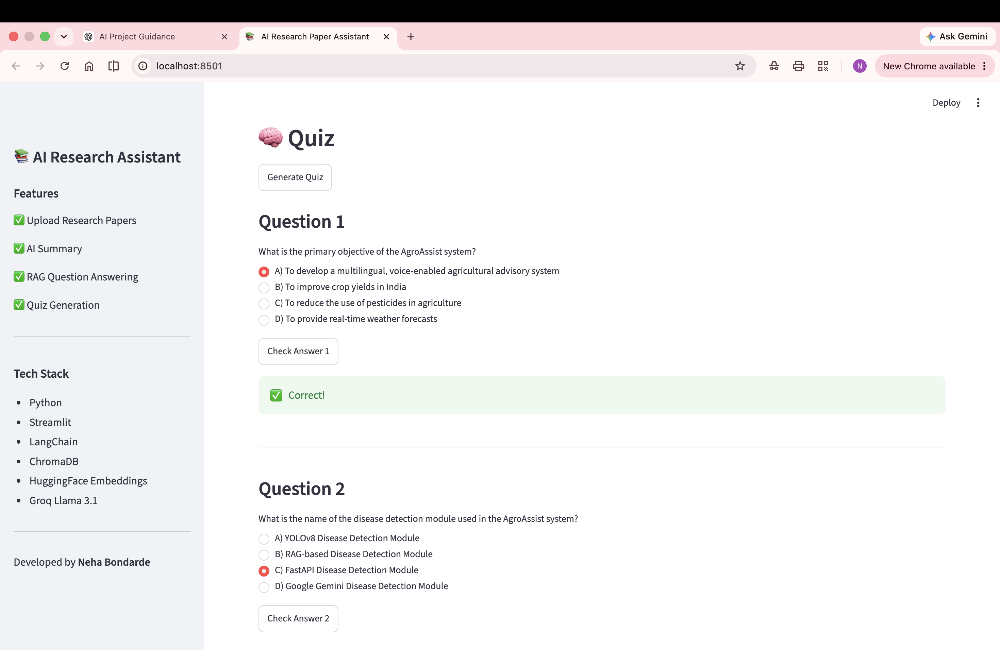

# 📚 AI Research Paper Assistant

An AI-powered Research Paper Assistant that helps users understand research papers by generating summaries, answering questions using Retrieval-Augmented Generation (RAG), and creating interactive quizzes.

---

## 🚀 Features

- 📄 Upload research papers in PDF format
- 📝 Generate AI-powered summaries
- ❓ Ask questions about the paper using RAG
- 🧠 Generate interactive multiple-choice quizzes
- 📚 Extract and display PDF text
- ⚡ Fast semantic search using vector embeddings

---

## 🖼️ Application Preview

> Add screenshots here after taking them.

### Home Page


### AI Summary


### Question Answering


### Quiz Generation


---

## 🏗️ Tech Stack

### Frontend
- Streamlit

### Backend
- Python

### AI Models
- Groq API (Llama 3.1)
- HuggingFace Embeddings

### RAG Components
- LangChain
- ChromaDB
- Sentence Transformers

### PDF Processing
- PyMuPDF (fitz)

---

## 📂 Project Structure

```text
AI-Research-Assistant/
│
├── app/
│   └── app.py
│
├── src/
│   ├── embeddings.py
│   ├── pdf_processor.py
│   ├── quiz_generator.py
│   ├── rag.py
│   ├── summarizer.py
│   └── vector_store.py
│
├── data/
│
├── images/
│
├── requirements.txt
├── README.md
├── .gitignore
└── .env
```

---

## ⚙️ Installation

### Clone the repository

```bash
git clone https://github.com/YOUR_USERNAME/AI-Research-Assistant.git
```

### Move into the project

```bash
cd AI-Research-Assistant
```

### Create a virtual environment

**Windows**

```bash
python -m venv .venv
.venv\Scripts\activate
```

**Mac/Linux**

```bash
python3 -m venv .venv
source .venv/bin/activate
```

### Install dependencies

```bash
pip install -r requirements.txt
```

### Create a `.env` file

```text
GROQ_API_KEY=YOUR_GROQ_API_KEY
```

### Run the application

```bash
streamlit run app/app.py
```

---

## 💡 How It Works

1. Upload a research paper (PDF).
2. The paper text is extracted.
3. The text is split into chunks.
4. Chunks are converted into vector embeddings.
5. ChromaDB stores the embeddings.
6. Relevant chunks are retrieved using semantic search.
7. Groq Llama 3.1 generates context-aware answers.
8. AI generates summaries and quizzes from the paper.

---

## 🎯 Future Improvements

- 📥 Download summary as PDF
- 📥 Download generated quiz
- 💬 Chat history
- 📊 Paper statistics
- 📚 Compare multiple research papers
- 🌙 Dark mode

---

## 👩‍💻 Author

**Neha Bondarde**

- GitHub: https://github.com/nehabondarde
- LinkedIn: https://linkedin.com/in/neha-bondarde-b37397331

---

## 📜 License

This project is intended for educational and research purposes.